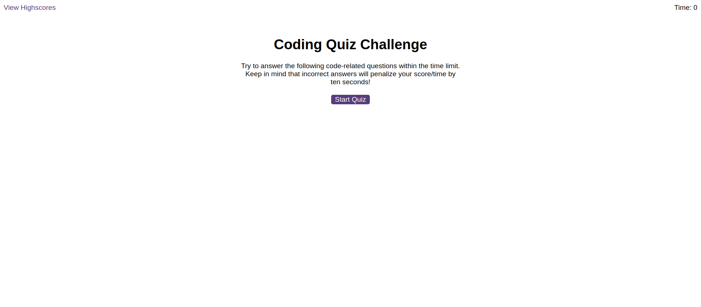

# Code_Quiz_EDementieva

## Description

The task in this Challenge is to create a timed, multiple-choice coding quiz that can keep track of high scores and quiz-takers' initials.

I've created an app that runs in the browser and features dynamically updated HTML and CSS, all powered by JavaScript code. The app adapts to multiple screen sizes.

## Installation

N/A

## Usage of the application:

WHEN clicking the start button
THEN a timer starts and a user is presented with a question.
After answering the first question
The user is presented with another question.
WHEN a question is answered incorrectly
THEN time is subtracted from the clock.
WHEN all questions are answered or the timer reaches 0
THEN the game is over.
WHEN the game is over
THEN the user can save their initials and score.

https://coralpeony.github.io/Password-Generator-EDementieva/

## Credits

N/A

## License

N/A

